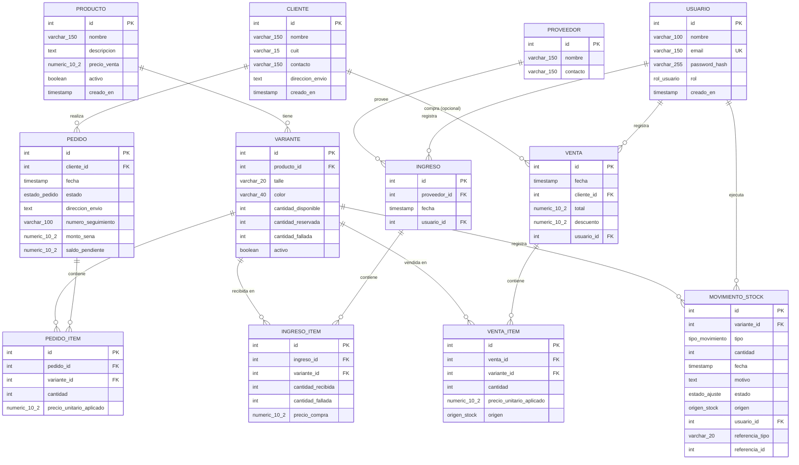

# Modelo de datos — Diagrama entidad-relación

Base relacional (PostgreSQL). Este archivo es la versión legible del modelo;
el detalle ejecutable está en [`schema.sql`](../../database/schema.sql), los datos de
prueba en [`seed.sql`](../../database/seed.sql) y una versión editable en
[`modelo.dbml`](./modelo.dbml) (para abrir en dbdiagram.io).

## Diagrama

*(Los tipos con guion bajo, ej. `numeric_10_2`, representan `numeric(10,2)`;
es una limitación de sintaxis de Mermaid, no del esquema real — ver
`schema.sql` para los tipos exactos.)*

## Entidades por función

**Catálogo** — `PRODUCTO`, `VARIANTE`: el precio vive en el producto; cada
variante (talle/color) mantiene tres contadores de stock independientes
(disponible, reservado, fallado).

**Ventas** — `VENTA`, `VENTA_ITEM`: venta de mostrador, cliente opcional
(puede ser anónima).

**Pedidos mayoristas** — `CLIENTE`, `PEDIDO`, `PEDIDO_ITEM`: el pedido
reserva stock desde su creación; guarda seña, saldo y dirección de envío
propias.

**Abastecimiento** — `PROVEEDOR`, `INGRESO`, `INGRESO_ITEM`: cada ingreso
agrupa lo recibido de un proveedor, con precio de compra por ítem.

**Trazabilidad** — `MOVIMIENTO_STOCK`: historial de todo cambio de stock
(ingreso, venta, reserva, liberación, confirmación de pedido, ajuste, falla).

**Usuarios** — `USUARIO`: dos roles (administrador / operativo); los
permisos se validan en el backend, no en la base.

## Decisiones de diseño

- El precio y la dirección de envío se copian al momento de la operación
  (`venta_item`, `pedido_item`, `pedido.direccion_envio`): un cambio
  posterior en el catálogo o en el cliente no altera operaciones ya
  registradas.
- El stock de una variante son tres contadores actuales (disponible,
  reservado, fallado), respaldados por el historial en `movimiento_stock`.
- En un ajuste, el stock se corrige de inmediato; el campo `estado`
  (pendiente/resuelto) refleja solo el seguimiento del reclamo con el
  proveedor, no si el número ya fue corregido.
- `cliente` no tiene un tipo fijo (minorista/mayorista): la diferencia está
  en el canal de la operación (`venta` vs. `pedido`), no en la persona.
- `movimiento_stock.cantidad` es siempre positiva (representa cuántas
  unidades se movieron); el efecto lo determina `tipo`, no el signo. La
  única excepción es `ajuste`, donde el signo sí importa: positivo si sobró
  stock, negativo si faltó.
- `variante` no admite dos filas idénticas para el mismo producto:
  `UNIQUE NULLS NOT DISTINCT (producto_id, talle, color)` hace que `NULL`
  participe de la comparación (no puede haber dos variantes "Negro" sin
  talle, ni dos variantes sin talle ni color). Talle y color no admiten
  cadena vacía; la ausencia se representa con `NULL`.
- Productos y variantes no se borran: se marcan `activo = false`. Las
  claves foráneas no tienen `ON DELETE CASCADE`, por lo que la base rechaza
  el borrado físico si existen operaciones históricas.
- `origen` (disponible / reservado / fallado) indica de qué contador sale la
  cantidad. En `venta_item` solo admite `disponible` o `fallado` (venta
  normal vs. oferta de stock fallado); en `movimiento_stock` refleja el
  contador principal afectado, así cada venta explica qué contador disminuyó.
- La descripción de una falla ya no vive en `variante` (dos prendas de la
  misma variante pueden tener fallas distintas): se registra en `motivo` de
  cada movimiento de tipo `falla`.

### Convención de `origen` en `movimiento_stock`

`origen` se guarda una vez por movimiento y no se modifica: es la huella de
qué contador de la variante cambió. Cada operación nueva crea un movimiento
nuevo con su propio `origen`.

| Tipo de movimiento | `origen` |
|---|---|
| `venta` | `disponible` o `fallado`, según de dónde salió la unidad |
| `ingreso` | `disponible` |
| `falla` | `fallado` |
| `reserva` | `disponible` (sale de ahí y pasa a reservado) |
| `liberacion` | `reservado` (sale de ahí y vuelve a disponible) |
| `confirmacion_pedido` | `reservado` (egresa definitivamente) |
| `ajuste` | el contador que se corrige |

La base de datos no valida esta tabla (si no se indica, `origen` queda en
`disponible`); respetarla es responsabilidad del backend y se verifica con
tests.

## Archivos relacionados

- [`schema.sql`](../../database/schema.sql) — script DDL ejecutable.
- [`seed.sql`](../../database/seed.sql) — datos de prueba.
- [`modelo.dbml`](./modelo.dbml) — versión editable para dbdiagram.io.
